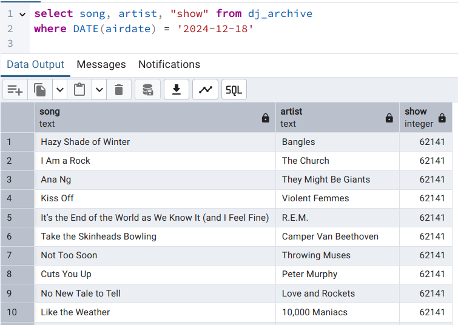
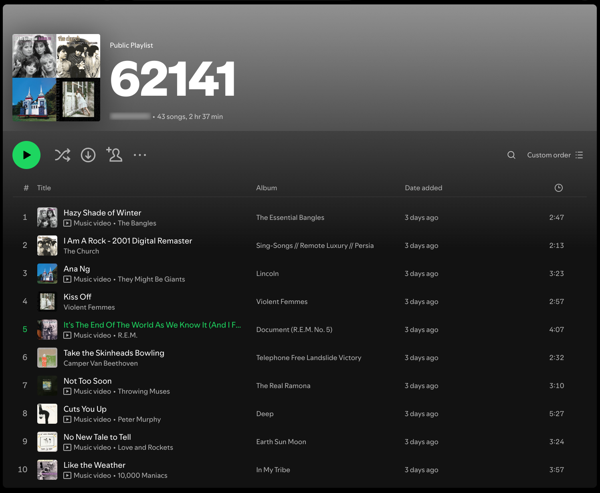

# playlist-from-dj
This code gets a list of songs played on a user-provided date from a particular DJ from the public radio station KEXP in Seattle. It then creates a playlist on Spotify with the songs that DJ played on that day. 

## How it works
### Create an archive of song play data

- Run utils/create_archive_gethost.py one time, to get the DJ's host ID from the radio station API, given the known time slots when the DJ hosts a show. 

- Run create_archive_getsongs.py. This Beam pipeline grabs historical song data via the radio station API, from the current date back to an arbitrarily set date (2000-01-01, since the station archive only goes back 25 years.)  Because the oldest dates drop off, I chose to save the raw API response ASAP. This data gets cached locally as json.

- Run create_archive_writejson_todb.py.  This code reads the cached json and writes it to a Postgres db.

### Create a playlist in Spotify based on a given date

- Run utils/request_spot_token.py to refresh the auth token

- Run create_playlist.py with an ISO formatted date ('2024-12-20') to get the list of songs and artists for a particular day's show. This will cache Spotify IDs to json, which potentially sidesteps rate limit difficulties in using Spotify's API.  (The future intent is to annotate the archive db to avoid repeat lookups.)

- Enjoy the playlist!

